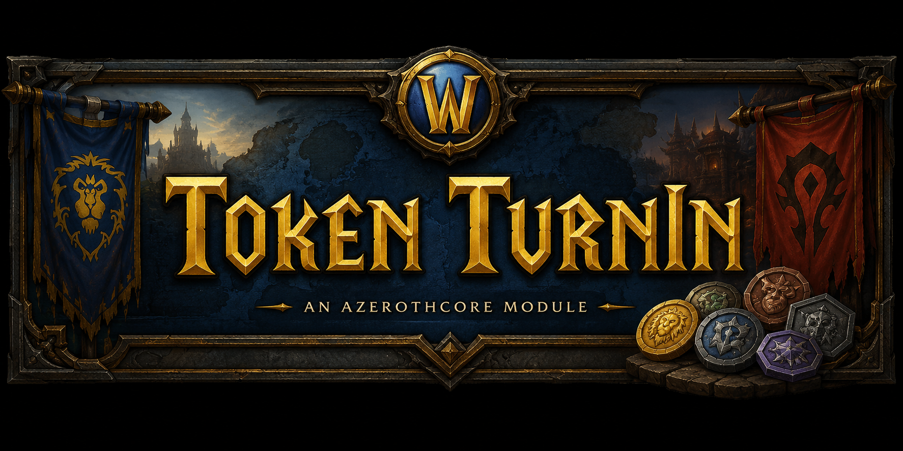

# mod-token-turnin

**An AzerothCore module for [mod-playerbots](https://github.com/liyunfan1223/mod-playerbots) that turns tier tokens into gear — no vendor trip, no alt login, no manual per-bot busywork.**

[English](README.md)

## Overview

Playerbots loot tier tokens just like real players, but unlike real players they can't walk themselves to a vendor and turn them in. Left alone, those tokens just sit in bag slots until someone logs into that specific character and does it manually — impractical when you're managing a full raid of bots.

`mod-token-turnin` adds a single chat command that scans a player's own bags, and (if grouped) their party's or raid's bags, for tier tokens. For every token found, it resolves the correct class- and spec-appropriate gear piece, destroys the token, and awards the item instantly.

The module is deliberately narrow in scope: it's a bot-management convenience tool, not a way to make gearing easier for real players. By default it only touches playerbots in your group, never your own character or real grouped players, unless you explicitly opt in.

## Features

- **One command, two modes** — `check` for a dry-run preview of what would happen, `redeem` to actually perform the conversion.
- **Full raid/party scanning** — point it at your group and it sweeps every bot's bags in one pass.
- **Spec-aware resolution** — reads each bot's actual invested talent tree (not just their "declared" spec) to award the correct itemization: tank gear for a Protection Paladin, healer gear for a Restoration Druid, and so on.
- **Class-correct token handling** — tokens shared across multiple classes (e.g. a token usable by Warrior, Priest, and Druid alike) resolve to the right class's gear automatically.
- **Stack-safe conversion** — a bag slot holding multiple stacked tokens converts in a single sweep, not one at a time.
- **Inventory-safe** — a bot with no free bag space keeps its token and gets a clear message, instead of losing the token for nothing.
- **Readable, clickable output** — `check` and `redeem` report real, quality-colored, clickable item links in chat, not plain text.
- **Configurable scope** — opt in to including your own character or real (non-bot) group members if you want the convenience for yourself too.
- **No vendor, no vendor-run mechanics** — token in, item out. No secondary materials, no NPC dialogue, no travel.

## Installation

1. Clone this module into your AzerothCore `modules/` directory:
   ```bash
   cd azerothcore-wotlk/modules
   git clone https://github.com/azerothcore/mod-token-turnin.git
   ```
2. Re-run CMake and rebuild `worldserver` as usual — modules are picked up automatically:
   ```bash
   cd ../build
   cmake .. -DCMAKE_INSTALL_PREFIX=$HOME/azeroth-server -DCMAKE_BUILD_TYPE=RelWithDebInfo
   make -j$(nproc) && make install
   ```
3. Copy the generated `mod_token_turnin.conf.dist` from your server's `conf/` directory to `mod_token_turnin.conf` and adjust settings if desired (see [Configuration](#configuration) below).
4. Apply the module's world database update — this happens automatically on next `worldserver` start via the DB updater, provided your server is configured to auto-apply updates.
5. Restart `worldserver`.

> This module has no hard dependency on mod-playerbots to *compile* — it builds and runs standalone. Without playerbots installed, group scans simply have no bots to find, and `TokenTurnIn.IncludeRealPlayers` becomes a no-op. It's meant to be used alongside mod-playerbots.

## Configuration

All options live in `mod_token_turnin.conf`:

| Option | Default | Description |
|---|---|---|
| `TokenTurnIn.Enable` | `1` | Master on/off switch for the `.tokenturnin` commands. |
| `TokenTurnIn.IncludeSelf` | `0` | Include the invoking player's own character in the scan. Off by default — this module is for bot management, not player convenience. |
| `TokenTurnIn.IncludeRealPlayers` | `0` | Include real (non-bot) group members, not just playerbots. Requires mod-playerbots to be built in; otherwise a no-op. |

`TokenTurnIn.IncludeSelf` and `TokenTurnIn.IncludeRealPlayers` are independent — any combination of on/off is valid.

## Text Commands

| Command | Description |
|---|---|
| `.tokenturnin check` | Dry run. Scans and reports what *would* be converted, without destroying or awarding anything. |
| `.tokenturnin redeem` | Live run. Performs the conversion — destroys tokens, awards gear. |

**Scope auto-detection:**
- Not grouped, and `IncludeSelf` is off (default) → nothing to scan, and you'll get a clear message saying so.
- In a party or raid → scans other group members who are playerbots by default. Real grouped players and your own character are excluded unless you've opted in via config.

You always trigger this manually — there's no passive or automatic conversion on loot.

### Example output

```
[TokenTurnIn] BotWarrior1 (Protection) -> Token: [Gloves of the Wayward Protector] -> Item: [Valorous Siegebreaker Gauntlets]
[TokenTurnIn] BotDruid2 (Restoration) -> Token: [Chestguard of the Fallen Defender] -> Item: [Chestguard of Malorne]
[TokenTurnIn] No convertible tokens found on BotMage3
```

Item and token names render as real in-game chat links, colored by item quality and clickable for a tooltip — just like a vendor or loot window.

## How It Works

1. **Scan** — the command walks the invoker's bags, and (if grouped) the bags of every eligible group member, looking for item entries that match a known tier token.
2. **Resolve spec** — for each bot carrying a token, the module reads the character's actual invested talent points directly from the core's talent data, and determines their dominant talent tree. This is more reliable than relying on a bot's "declared" spec, which can be stale or unset.
3. **Look up the correct item** — token, class, and talent tree together resolve to exactly one correct gear piece via the module's data table. A token shared across multiple classes (common in tier-token design) still resolves correctly per class.
4. **Convert** — on `redeem`, the token is destroyed and the resolved item is awarded, using the bot's actual stack count so a slot of multiple tokens converts in one pass. If there's no free bag space, the bot keeps the token and you're told why.

No vendor NPC, no travel, no dialogue — everything happens through the chat command.

## Supported Content

Tier token data is added incrementally, tier by tier, and verified in-game before being considered done.

| Tier | Raid(s) | Difficulty | Status |
|---|---|---|---|
| T3, Zul'Gurub, AQ20/AQ40 | — | — | 🔜 Planned |
| T4 | Karazhan / Gruul's Lair / Magtheridon's Lair | Normal | ✅ Implemented |
| T5 | Serpentshrine Cavern / The Eye | Normal | ✅ Implemented |
| T6 | Black Temple / Hyjal Summit / Sunwell Plateau | Normal | ✅ Implemented |
| T7 | Naxxramas / The Eye of Eternity / The Obsidian Sanctum | 10-man & 25-man | ✅ Implemented |
| T8 | Ulduar | 10-man & 25-man | ✅ Implemented |
| T9, T10 | Trial of the Crusader / Icecrown Citadel | — | ❌ Out of scope — see below |

**T9/T10 are intentionally out of scope.** In those tiers, base tier gear is purchased from a vendor with emblem currency rather than looted as a token, and the heroic upgrade item isn't slot-specific — it requires a player's choice of which piece to upgrade. Neither mechanic fits this module's "find token, destroy it, award its paired item" model without inventing behavior the player never asked for.

## Contributing

Found a wrong token/item mapping, a class that resolves to the wrong gear, or anything else? Bug reports and pull requests are welcome — see the [AzerothCore contributing guide](https://www.azerothcore.org/wiki/how-to-contribute) for the general process.

## License

Released under the [MIT License](../LICENSE).
